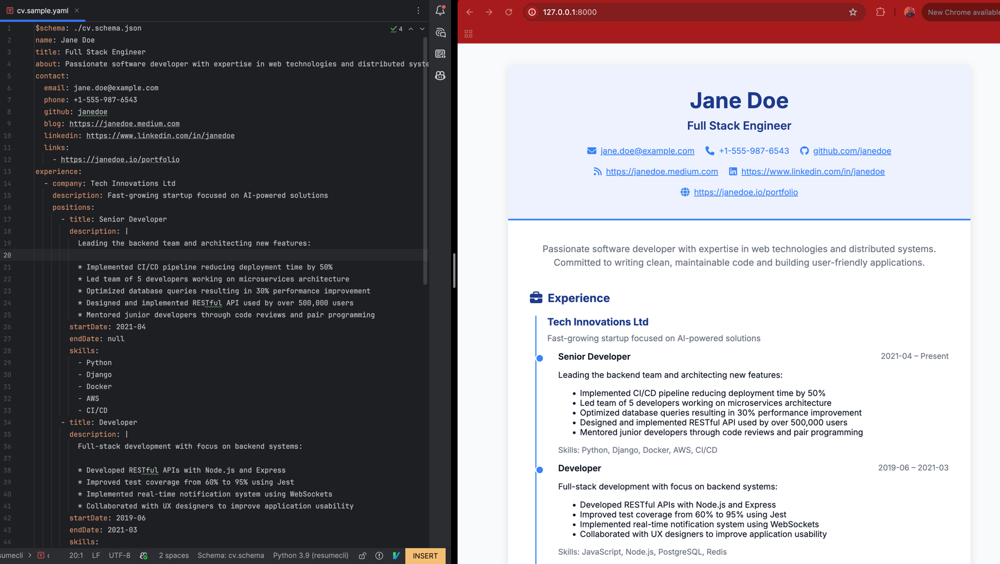

Resumecli
---------------

Maintaining my resume was quite a hassle for me.
I had to update it in a website. More often that not, I would
forget the name of the website the next time I needed to update it.
Or the resume template would not be free anymore. In some platforms,
there was a lot of dragging and dropping and resizing of text boxes.

So at the end of the day, I decided to create my own resume generator.
The idea is to maintain the resume in a simple text format (YAML).
This way, I can edit it with any text editor and put it in a private git repo
if I want to.

### Installation
To install resumecli, navigate to the [release page](https://github.com/pdrum/resumecli/releases) and
download the archive for your platform. Extract it and navigate to the extracted folder in your terminal.
Then run the command below to install the package. For Mac you should have [Homebrew](https://brew.sh/)
installed before running the command.

```bash
./resumecli.sh
```

Now you need to open a new terminal and you are ready to use resumecli.

### Usage



1. To start using resumecli, you need to first run `resumecli new cv.yaml`. This command creates a sample
cv file named `cv.yaml` and puts the json schema file `cv.schema.json` right next to it. This helps your editor
give better autocompletion and validation while you edit the yaml file.
2. Next step is to edit the `cv.yaml` file and put your information in it. While you do this, you can run
`resumecli preview cv.yaml`. Then on port 8000 of your localhost, you can see a live preview of your resume
as your editing it. If port 8000 is busy, you can customize the port with the `--port` option.
3. Once you are happy with your resume, you can generate a pdf file with the command
`resumecli build cv.yaml -o cv.pdf`. You can customize the name of the output file name with the `-o` option.
Otherwise it falls back to `output.pdf`.


### Development mode
If you want to contribute to the project, you can clone the repository and run the following commands

To build the docker image:
```bash
docker build -f Dockerfile.dev -t resumecli-dev .
```

To run the docker image run this after navigating to the root of the repository:
```bash
docker run --rm -it -v "$(pwd)":/app -p 8000:8000 resumecli-dev
```

This will open a shell inside the container.
You can run the resumecli commands from any directory as you would normally do.
